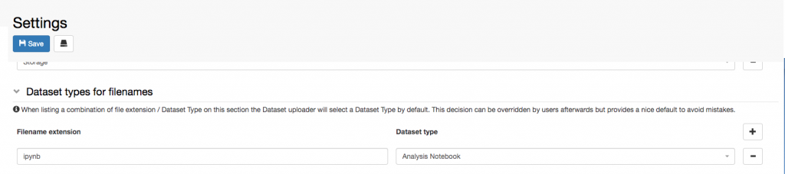

  
It is possible to associate given file types to given _Dataset_ _types_. In this way when a file of this type is uploaded, the _Dataset_ _type_ is automatically selected.

For example, a Jupyter notebook, which has extension **.ipynb** can always be associated with the _Dataset_ _type_ **Analysis Notebook**.

