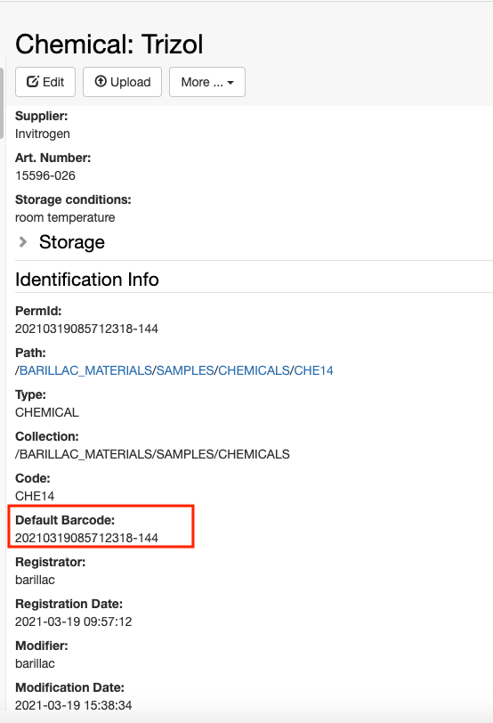
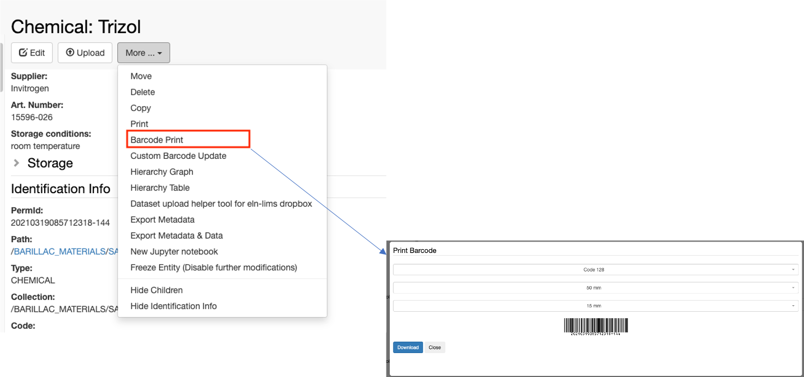
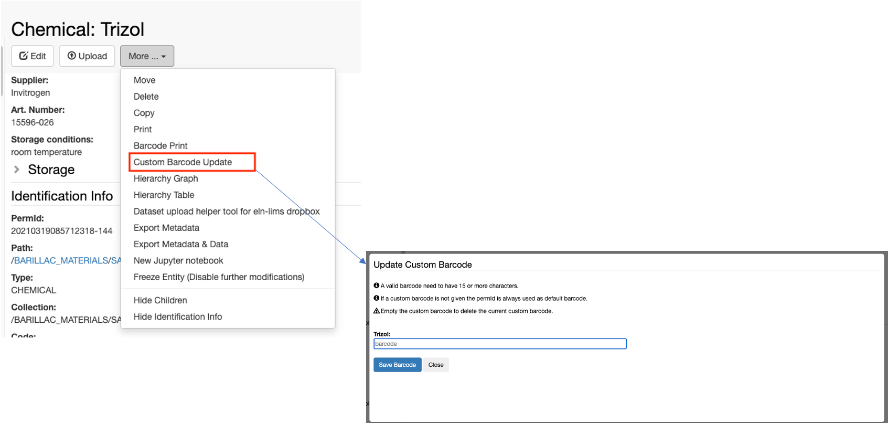
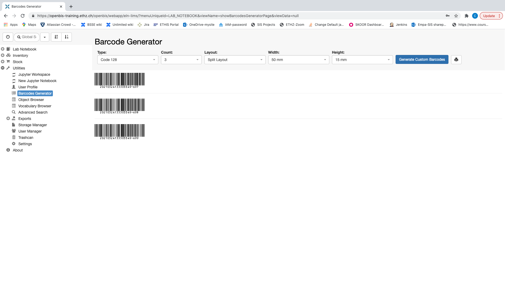

The barcode functionality must be enabled in openBIS by a group admin: [Enable Barcodes](https://openbis.ch/index.php/docs/admin-documentation-openbis-19-06-4/enable-barcodes/).

## Barcodes for individual samples

When a sample is registered, a barcode is automatically generated by openBIS. This is found in the **Identification info** section, as shown below.

This barcode can be printed and the label can be added to the vial containing the sample. The option to print the barcode is under the  **More..** menu

If a sample already has a barcode, it is possible to scan this and assign it to the sample. This can be done after registration of a sample, with the **Custom Barcode Update** option under the **More..** drop down.

The custom barcode will appear in the _Identification Info_. If a custom barcode is registered, the print function shown above will print the custom barcode, instead of the default one.

## Generate batches of barcodes

In some cases there is the need to generate several barcodes that can be later on assigned to samples registered in openBIS.

To generate new barcodes, go to the **Barcodes Generator** in the main menu under **Utilities**.

Users can select:

1. The type of barcode to generate:
    1. _Code 128_
    2. _QR Code_
    3. _Micro QR code_
2. The number of barcodes to generate
3. The layout:
    1. _Split_: one barcode per page
    2. _Continuous_: several barcodes in one page
4. The width of the barcode
5. The length of the barcode

After selecting the desired parameters, click the **Generate Custom Barcodes** button.

To print the barcodes use the **print icon** on the form, next to **Generate Custom Barcodes**. These barcodes can be print on labels to go on vials. When the samples are registered in openBIS, these barcodes can be scanned and assigned to the samples as explained above.
