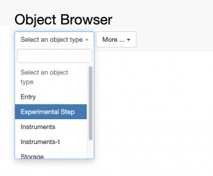

  
All entries of the same type and all Experimental Steps, which may be contained in different _Experiments/Collections_ and _Projects_, can be browsed using the _Object Browser_ under the _Utilities_ main menu.

This is useful when there are entries of a certain type stored in different collections (e.g. protocols of the same type stored in two different protocol collections), or to have an overview of all _Experimental Steps_, independently of the _Experiment_ they belong to.
