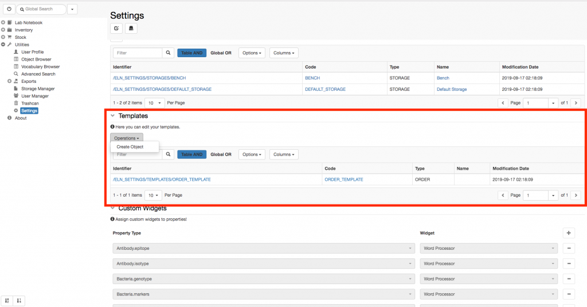
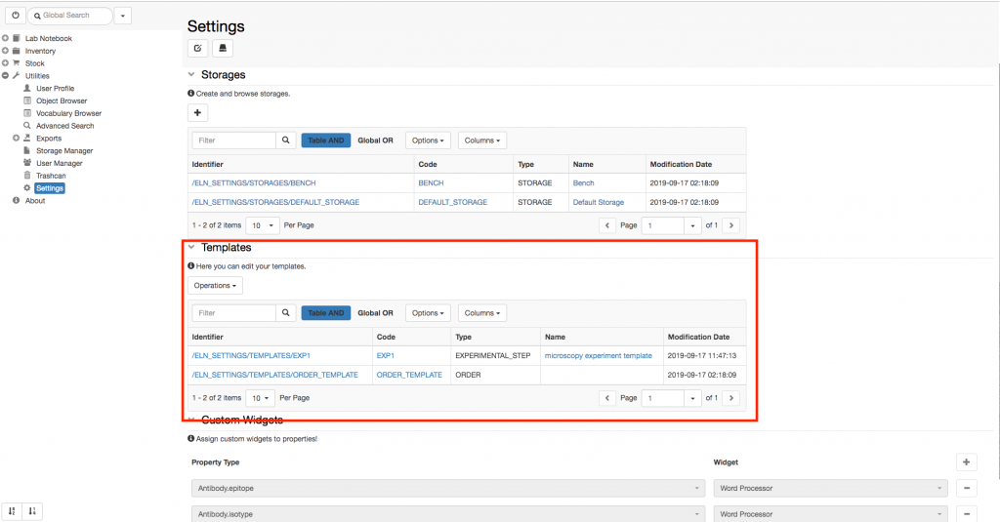

  
It is possible to create templates for _Objects_. For each _Object_ type several templates can be created. This can be done by the lab manager, who has admin rights for editing the **Settings**.

  
Procedure:  
  

1. Go to the **Settings**, under **Utilities**
2. Scroll down to the **Templates** section
3. From the **Operations** dropdown select **Create Object**

1. Select the _Object Type_ for which you want to create a template
2. Fill in the fields as desired
3. **Save**

  
Your templates will show in the table in the Templates section, as seen below

