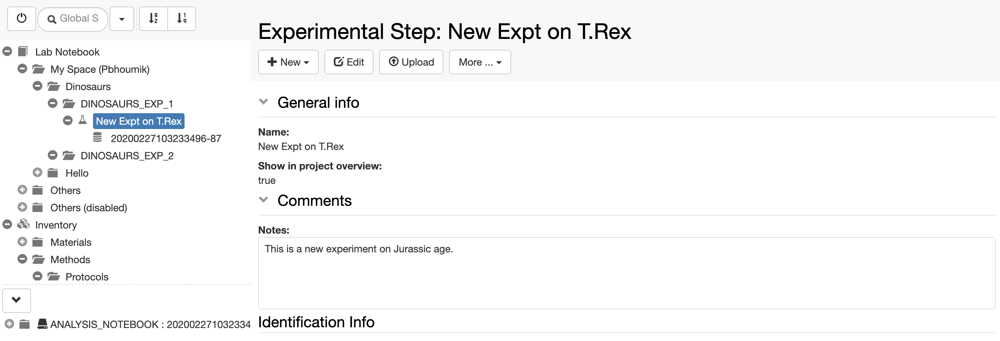
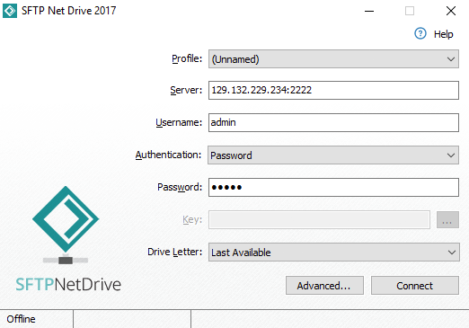
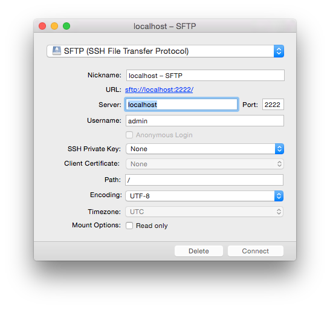
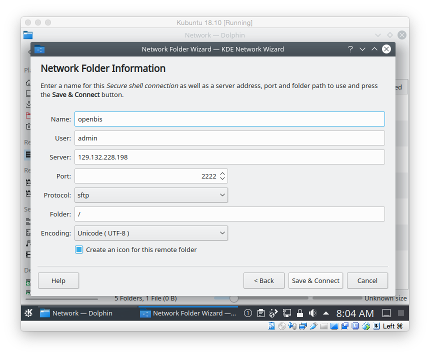
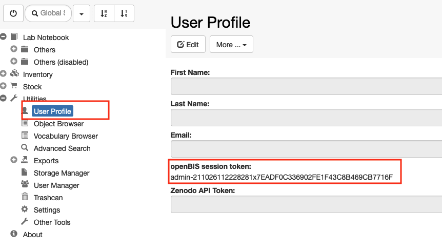

  
_Datasets_ are displayed on the left hand-side of the _Experiment/Object_ form, as shown below.

To navigate and open data registered in openBIS via Finder or Explorer, open the _Dataset_ folder and click on the drive icon next to the Dataset type name_._ If SFTP has been configured by a system admin, you will be provided with a link to copy/paste in an application such as [Cyberduck](https://cyberduck.io/) or other.

Please check our documentation for SFTP server configuration: [Installation and Administrators Guide of the openBIS Data Store Server](https://unlimited.ethz.ch/display/openBISDoc2010/Installation+and+Administrators+Guide+of+the+openBIS+Data+Store+Server#InstallationandAdministratorsGuideoftheopenBISDataStoreServer-ExampleSFTPclientconfiguration)

For native access through Windows Explorer or Mac Finder we recommend the following:

- Windows 10: [https://www.nsoftware.com/sftp/netdrive/](https://www.nsoftware.com/sftp/netdrive/)
- Mac OS X Yosemite and higher: [https://mountainduck.io](https://mountainduck.io/)
- Kubuntu: Default Dolphin File Manager with SFTP support

  
Example of SFTP Net Drive configuration:

Example of Mountain Duck configuration:

Example of  Dolphin File Manager configuration:

To access the Dataset form and edit the Dataset metadata, click on the Dataset code or Name (if provided).

## SFTP access via session token

To access via session token (for example when using SSO authentication) you need to provide the following credentials:

**Username: ?**

**Password: session token**.

The session token can be copied from the **User Profile** under **Utilities** in the main menu, as shown below.

