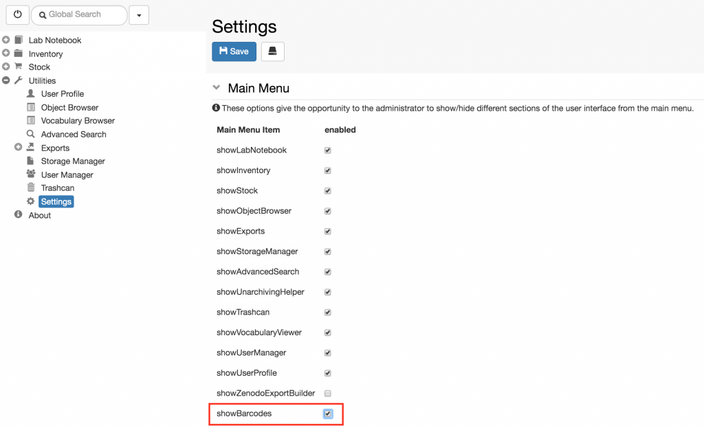

The barcode functionality is disabled by default. A group admin can enable it in the **Settings**, as shown below. After enabling the option, please refresh your browser. The **Barcodes Generator** will be shown in the main menu under **Utilities**.

