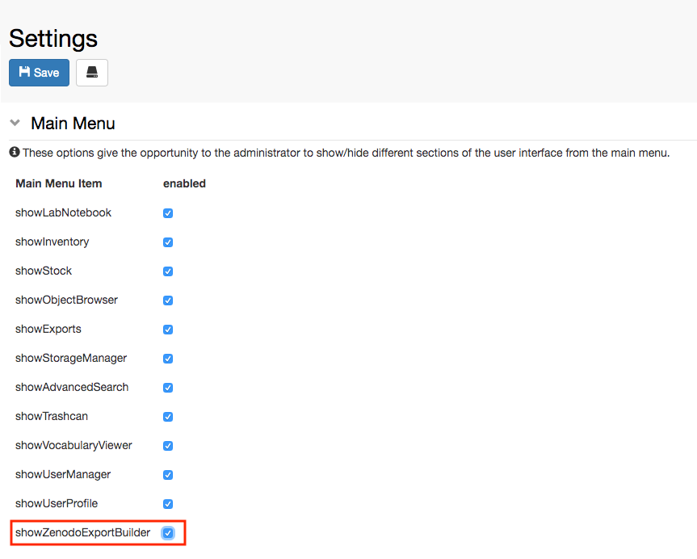

  
Currently openBIS offers an integration with the **Zenodo** data repository ([https://zenodo.org/).](https://zenodo.org/)

This enables data direct data transfer from openBIS to Zenodo. This feature needs to be enabled by a lab manager, who has admin rights for the **Settings**.

  
Procedure:  
  

1. Go to **Settings** under **Utilities**
2. Enable **editing**
3. Select **showZenodoExportBuilder** in the **Main Menu** section
4. **Save**

