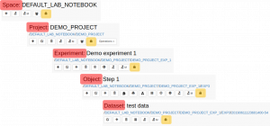
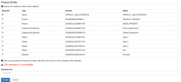

  
Each level of the openBIS hierarchy (Space, Project, Experiment/Collection, Object, Dataset) can be frozen, so it can be no longer edited and/or deleted.

At every level, everything contained underneath is selected by default to be frozen. E.g. if I choose to freeze a Space, everything contained in the Space is automatically selected to be frozen. Single entities can be manually unselected.

A Space admin role is necessary to freeze entities in a given Space.  
  

**IMPORTANT: the freezing is IRREVERSIBLE!**  
  

This operation cannot be undone from any UI, not even by an _Instance admin._ Please freeze entities only when you are absolutely sure that they should not be further modified!

##   
**How to freeze an entity**

  
Each level of the openBIS hierarchy has a lock icon in the menu toolbar, as shown below.

Click on the icon and a list of entities contained or connected to the one selected will be presented to you, as shown below.

Provide your login password and save.

##   
Rules for freezing  
  

1. **Freeze Space only**

<table style="height: 634px;" border="1" width="841"><tbody><tr><td width="194">&nbsp;</td><td width="179">Allowed</td><td width="179">Not allowed</td></tr><tr><td width="194">Create new Project</td><td width="179">&nbsp;</td><td width="179">x</td></tr><tr><td width="194">Create new Experiment/Collection</td><td width="179">x</td><td width="179">&nbsp;</td></tr><tr><td width="194">Create new Object</td><td width="179">&nbsp;</td><td width="179">x</td></tr><tr><td width="194">Create new Dataset in existing Experiment/Collection</td><td width="179">x</td><td width="179">&nbsp;</td></tr><tr><td width="194">Create new Dataset in existing Object</td><td width="179">x</td><td width="179">&nbsp;</td></tr><tr><td width="194">Edit existing Project</td><td width="179">x</td><td width="179">&nbsp;</td></tr><tr><td width="194">Edit existing Experiment/Collection</td><td width="179">x</td><td width="179">&nbsp;</td></tr><tr><td width="194">Edit existing Object</td><td width="179">x</td><td width="179">&nbsp;</td></tr><tr><td width="194">Edit existing Dataset</td><td width="179">x</td><td width="179">&nbsp;</td></tr><tr><td width="194">Delete Space</td><td width="179">&nbsp;</td><td width="179">x</td></tr><tr><td width="194">Delete Project</td><td width="179">&nbsp;</td><td width="179">x</td></tr><tr><td width="194">Delete Experiment/Collection</td><td width="179">x</td><td width="179">&nbsp;</td></tr><tr><td width="194">Delete Object</td><td width="179">x</td><td width="179">&nbsp;</td></tr><tr><td width="194">Delete Dataset</td><td width="179">x</td><td width="179">&nbsp;</td></tr><tr><td width="194">Move Experiment/Collection</td><td width="179">x</td><td width="179">&nbsp;</td></tr><tr><td width="194">Move Object</td><td width="179">x</td><td width="179">&nbsp;</td></tr><tr><td width="194">Copy Object</td><td width="179">&nbsp;</td><td width="179">x</td></tr></tbody></table>

  
**2\. Freeze Project only**  
  

<table class="wp-block-table"><tbody><tr><td>&nbsp;</td><td>Allowed</td><td>Not allowed</td></tr><tr><td>Create new Experiment/Collection</td><td>&nbsp;</td><td>x</td></tr><tr><td>Create new Object</td><td>&nbsp;</td><td>x</td></tr><tr><td>Create new Dataset in existing Experiment/Collection</td><td>
x
</td><td>&nbsp;</td></tr><tr><td>Create new Dataset in existing Object</td><td>x</td><td>&nbsp;</td></tr><tr><td>Edit Project</td><td>&nbsp;</td><td>x</td></tr><tr><td>Edit existing Experiment/Collection</td><td>x</td><td>&nbsp;</td></tr><tr><td>Edit existing Object</td><td>x</td><td>&nbsp;</td></tr><tr><td>Edit existing Dataset</td><td>x</td><td>&nbsp;</td></tr><tr><td>Delete Project</td><td>&nbsp;</td><td>x</td></tr><tr><td>Delete Experiment/Collection</td><td>&nbsp;</td><td>x</td></tr><tr><td>Delete Object</td><td>&nbsp;</td><td>x</td></tr><tr><td>Delete Dataset</td><td>&nbsp;</td><td>x</td></tr><tr><td>Move Experiment/Collection</td><td>&nbsp;</td><td>x</td></tr><tr><td>Move Object</td><td>&nbsp;</td><td>x</td></tr><tr><td>Copy Object</td><td>&nbsp;</td><td>x</td></tr></tbody></table>

  
**3\. Freeze Experiment/Collection only**  
  

<table class="wp-block-table"><tbody><tr><td>&nbsp;</td><td>Allowed</td><td>Not allowed</td></tr><tr><td>Create new Object</td><td>&nbsp;</td><td>x</td></tr><tr><td>Create new Dataset in existing Experiment/Collection</td><td>&nbsp;</td><td>x</td></tr><tr><td>Create new Dataset in existing Object</td><td>&nbsp;</td><td>x</td></tr><tr><td>Edit existing Experiment/Collection</td><td>&nbsp;</td><td>x</td></tr><tr><td>Edit existing Object</td><td>x</td><td>&nbsp;</td></tr><tr><td>Edit existing Dataset</td><td>x</td><td>&nbsp;</td></tr><tr><td>Delete Experiment/Collection</td><td>&nbsp;</td><td>x</td></tr><tr><td>Delete Object</td><td>&nbsp;</td><td>x</td></tr><tr><td>Delete Dataset</td><td>&nbsp;</td><td>x</td></tr><tr><td>Move Experiment/Collection</td><td>&nbsp;</td><td>x</td></tr><tr><td>Move Object</td><td>&nbsp;</td><td>x</td></tr><tr><td>Copy Object</td><td>&nbsp;</td><td>x</td></tr></tbody></table>

  
**4\. Freeze Object only**  
  

<table class="wp-block-table"><tbody><tr><td>&nbsp;</td><td>Allowed</td><td>Not allowed</td></tr><tr><td>Create new Dataset in existing Object</td><td>&nbsp;</td><td>x</td></tr><tr><td>Edit existing Object</td><td>&nbsp;</td><td>x</td></tr><tr><td>Edit existing Dataset in Object</td><td>x</td><td>&nbsp;</td></tr><tr><td>Delete Object</td><td>&nbsp;</td><td>x</td></tr><tr><td>Delete Dataset</td><td>&nbsp;</td><td>x</td></tr><tr><td>Move Object</td><td>&nbsp;</td><td>x</td></tr><tr><td>Copy Object</td><td>x (only if the Experiment is not frozen)</td><td>&nbsp;</td></tr></tbody></table>

  
**5\. Freeze Dataset only**  
  

<table class="wp-block-table"><tbody><tr><td>&nbsp;</td><td>Allowed</td><td>Not allowed</td></tr><tr><td>Edit existing Dataset</td><td>&nbsp;</td><td>x</td></tr><tr><td>Delete Dataset</td><td>&nbsp;</td><td>x</td></tr><tr><td>Move Dataset</td><td>&nbsp;</td><td>x</td></tr></tbody></table>
