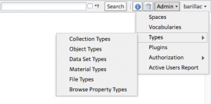
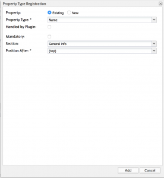
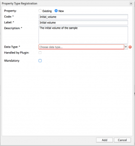

  
Entity types, i.e. _Experiment/Collection_, _Object_ and _Dataset_ types can be created by someone with _Instance admin_ role in the **standard openBIS UI**.

  
The standard openBIS UI can be accessed via a URL of this type: **https://openbis-xxx/openbis/**

  
where openbis-xxx is the name of the server specified in the openBIS configuration file, during the installation by a system admin.

##   
Register a new Experiment/Collection type

1. Select **Types** \-> **Collection Types** from the **Admin** drop down menu.
2. Click **Add** at the bottom of the newly opened page.
3. Enter a **Code**. Codes only take alphanumeric characters and no spaces. This should be something meaningful for the type of experiment we are creating, e.g. **MICROSCOPY\_EXPERIMENT.**
4. Provide a description (not mandatory)
5. Click **Entity:Add** at the bottom of the page to add properties (fields). It is possible to choose from a list of registered properties or to register new properties.

####   
Choose from existing properties

1. It is highly recommended to always add the property **Name**.
2. Select if the property is mandatory.
3. Choose or create a **Section**. Sections are ways of grouping together similar properties. Examples of sections used in the ELN are _General info_, _Storage info_, _Parents_, etc.
4. Choose where the property is to be shown on the Experiment/Collection form.

####   
Register a new property

1. Provide the Property **Code** (only alphanumeric characters and no spaces).
2. Provide the Property **Label**. This is shown in the forms instead of the code.
3. Provide a **Description** for the Property.
4. Select the **type** from the list of available types:
    1. **BOOLEAN**: yes or no
    2. **CONTROLLEDVOCABULARY**: list of predefined values
    3. **HYPERLINK**: URL
    4. **INTEGER**: whole number
    5. **MULTILINE\_VARCHAR**: long text. It is possible to enable a Rich Text Editor for this type of property. This is described here: [Enable Rich Text Editor or Spreadsheet Widgets](https://openbis.ch/index.php/docs/admin-documentation/new-entity-type-registration/set-properties-as-rich-text-editor-or-spreadsheet/)
    6. **REAL**: decimal number
    7. **TIMESTAMP**: date
    8. **VARCHAR**: one-line text
    9. **XML**: to be used by _Managed Properties_ (see [Managed Properties](https://wiki-bsse.ethz.ch/display/openBISDoc1906/Managed+Properties)) and for _Spreadsheet component_s, as described here: [Enable Rich Text Editor or Spreadsheet Widgets](https://openbis.ch/index.php/docs/admin-documentation/new-entity-type-registration/set-properties-as-rich-text-editor-or-spreadsheet/)
5. Select if the property is mandatory.

  
_Object_ and _Dataset types_ are registered in a very similar way.

##   
Register a new Object type

1. Select **Types -> Object Types** from the **Admin** drop down menu.
2. Click **Add** at the bottom of the newly opened page.
3. Enter a **_Code_**. E.g. **INSTRUMENT**.
4. Provide a description (not mandatory).
5. Leave all selectable options as provided by default.
6. Enter the **Generated Code Prefix**. It is recommended to use the first 3 letters of the _Object_ code (e.g. **INS**, in this case). This field is used by openBIS to automatically generate Object codes: the codes will be for example INS1, INS2, INS3, etc.
7. Click **Entity:Add** at the bottom of the page to add properties (fields), as described above.
    - A new _Object type_ should always have the predefined properties **Name** and **Annotations state**_._ The last property is not visible in any of the forms, but it is necessary to establish parent/child relationships between Objects.
8. Click **Save** at the bottom of the page.

##   
Register a new Dataset type

1. Select **Types -> Data Set Types** from the **Admin** drop down menu.
2. Click **Add** at the bottom of the newly opened page.
3. Enter a **Code**. E.g. **RAW\_DATA**.
4. Enable **Disallow Deletion**, if datasets of this type should never be deleted.
5. Add properties as described above.
6. Click **Save** at the bottom of the page.
