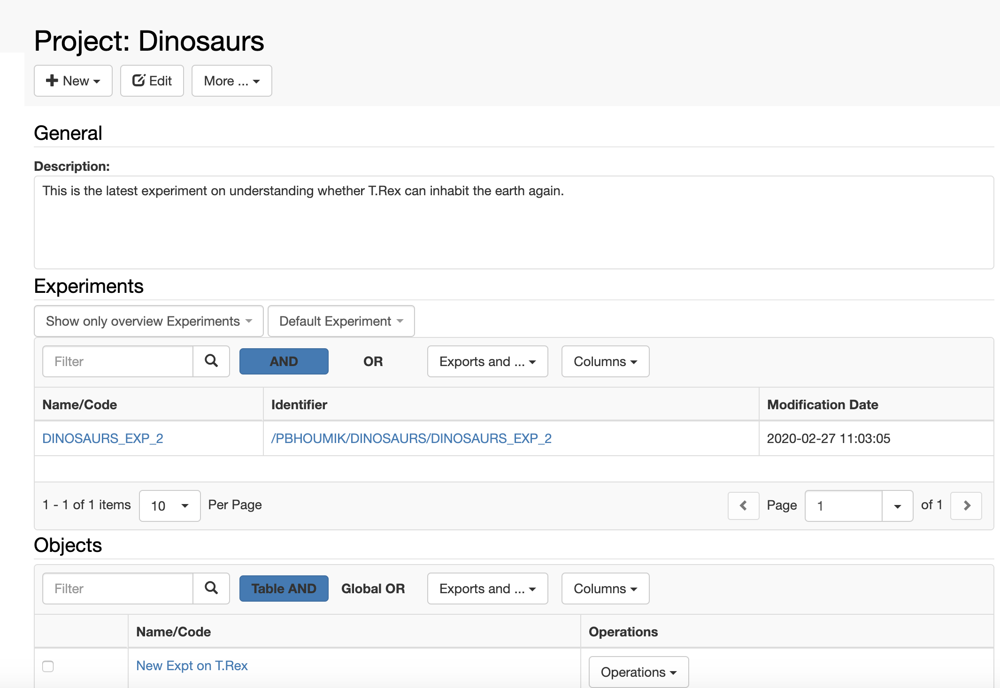

  
All _Experiments_ and _Experimental Ste_ps have a **Show in project overview** checkbox. When selected, these _Experiments_ and/or _Experimental Steps_ will be shown in the _Project_ form, as shown below.

This allows users to have a better overview of a _Project_ and highlight the most important findings

