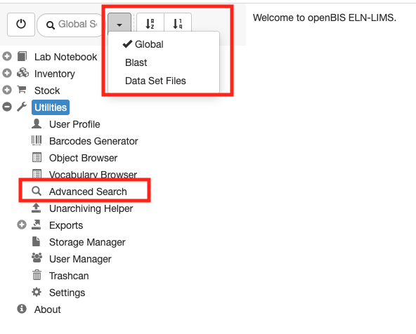
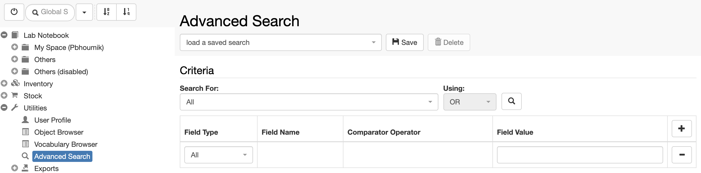
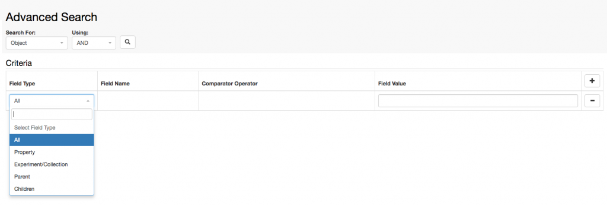
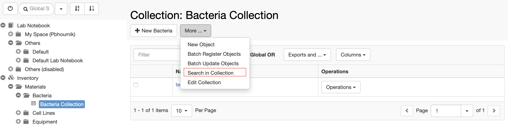
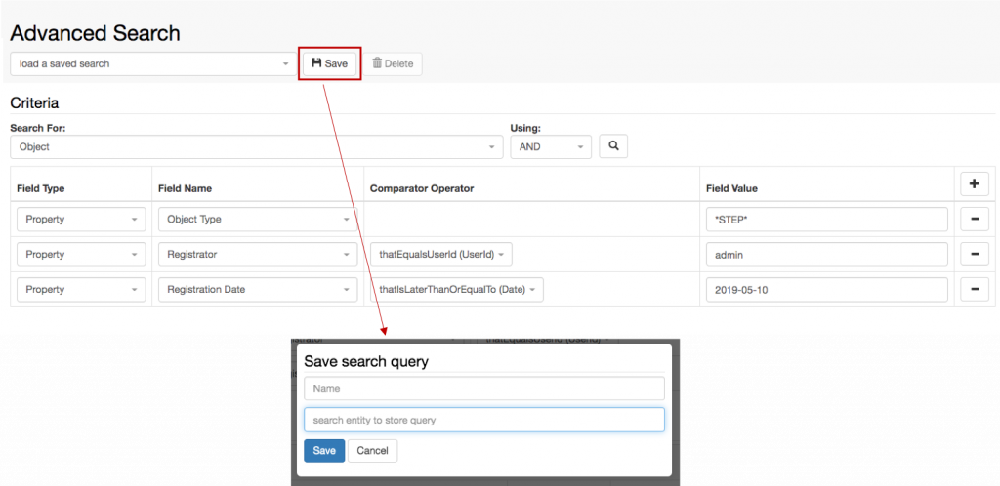

  
Different types of searches are available in openBIS:

1. Global search
2. BLAST serach
3. Data Set Files Search

##   
Global search

This functionality, available from the main menu, performs a search across all database fields. Results are presented in a table that can be further filtered. The search can be also be further refined (see Advanced search below).

##   
Advanced search

The advanced search can be accessed from the main menu, under _Utilities_. Alternatively, the advanced search can be used after performing a generic search, to refine the obtained results.

In the advanced search users can combine several AND or OR searches. Users can limit the search to Experiments, Objects, or Datasets or can search across all of them. It is also possible to restrict the search to a specific Object type.

The search can be further restricted to specific fields.

Multiple conditions can be added to a search, by clicking the + button in the **search Criteria** table.

###   
Search Collection

From a Collection page it is possible to launch an advanced search limited to _Objects_ of the _Collection_, by selecting **Search in Collection** from the **More** drop down.

##   
BLAST search

This performs a BLAST search over nucleotide sequences contained either in the **Sequence** _Object_ field or in _Datasets_ of type **SEQ\_FILES**. Results are shown in a table, sorted by E-value.

##   
Data Set File search

This allows users to search across names of files stored in openBIS Datasets.

##   
Save & reuse searches

It is possible to save and re-use searches. _Space_ _admin_ rights are required to save searches in a given space. Searches can be used by anyone with User or Observer rights to a given Space.

In the Advanced Search page, build your search criteria (see example below). To save the search, click the **Save** button and enter:

1. The **Name** of the search
2. The **Experiment/Collection** where the search should be stored

Searches are stored in Experiments/Collections.

  
We recommend to create a **Queries** collection in a personal folder and in the **Materials** and **Methods** in the Inventory to store searches.

