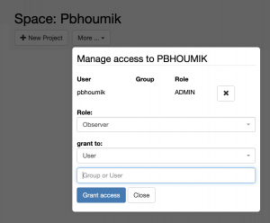
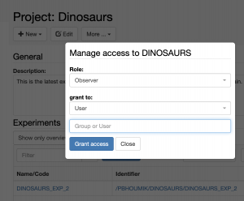

  
It is possible to share either a complete lab notebook or single _Projects_, using the **user management** button  in the main lab notebook folder (_Space_) or in the _Project_ folder.

Available roles are:

1. **Observer**: read-only access to Space or Project
2. **User**: can create and modify entities in Space or Project
3. **Admin**: can create, modify and delete entities in Space or Project
