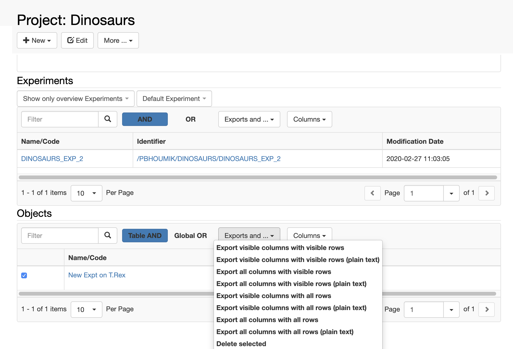
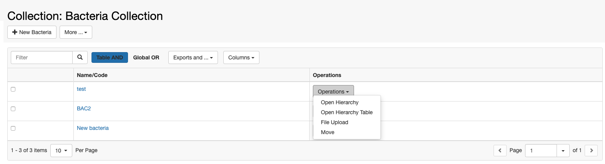

  
All tables in the ELN have a similar format and functionalities:

> 1. **Filter**_._ When multiple values are entered in the Filter field, the filtering can be performed in one or two ways, depending on the table type (experiment or object table):
>     1. _Table AND_. This performs an AND search across all entities listed in the table. This is available in all table types.  
>         
>     2. _Global OR._ This performs an OR search on all entities to which the user has access in the database, not just the entries in the table. This option is only avaliable in Objects tables.
> 2. **Export.** Tables can be exported in different ways, from the _Exports and..._ drop down menu,.  Please remember NOT TO USE plain text tables for batch update!
> 3. **Columns display**_._ Users can select which properties to display in th etable from the _Columns_ drop down menu. This information is stored in the database for each user.
> 4. **Delete multiple entities.** Users can select multiple entities in a table and then choose the _Delete selected_ option from the _Exports and_ drop down menu.  

In _Object_ tables there is an **Operations** column, which allow users to perform certain tasks on an _Object_:

> 1. Open the hierarchy graph.
> 2. Open the hierarchy table.
> 3. Upload a file to the Object.
> 4. Move the Object to another Experiment/Collection.

