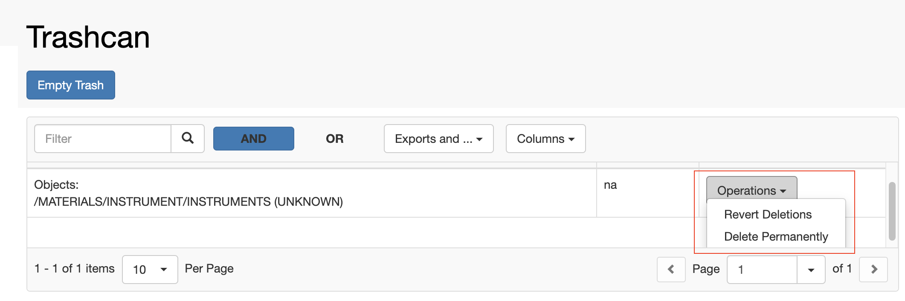

  
When _Experiments_, _Objects_ and _Datasets_ are deleted, they are moved to the openBIS **trashcan**, under the **Utilities** main menu. Items can be removed from the trashcan only by someone with _Space admin_ or _Instance admin_ role. Deletion from the trashcan is **IRREVERSIBLE**.

It is possible to either delete single entities, by selecting **Delete** **Permanently** from the **Operations** dropdown in the table, or to empty the whole trashcan, by clicking the blue **Empty Trash** button above the table.

If one entity was unintentionally deleted, the operation can be reverted at this stage by choosing the **Revert Deletions** option from the **Operations** drop down in the table.

