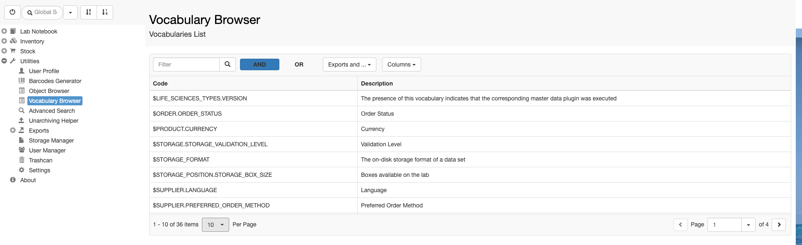

  
The Vocabulary browser is accessible from the Utilities main menu. This shows all vocabularies registered in openBIS and the terms they contain. Vocabularies are predifined lists of values to choose from in given fields. Vocabularies can be created/modfied by an openBIS _Instance admin_ (see [New Entity Type Registration](https://openbis.ch/index.php/docs/admin-documentation-openbis-19-06-4/new-entity-type-registration/)).

This information is needed for filling the forms for _Batch Upload_ or _Batch Update_ of Objects. If an Object has a property of type _Controlled Vocabulary_, the codes of the vocabulary have to be entered in the form.

