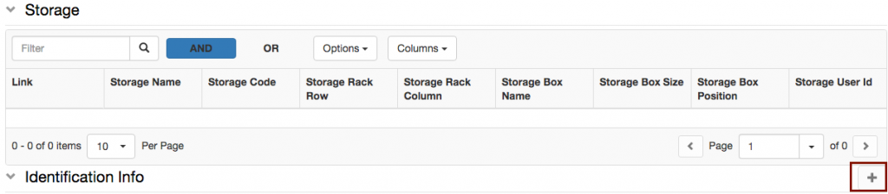
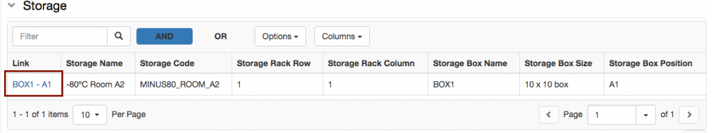

  
For some samples, we may need to register the storage location in the lab.

Lab storages need to be configured by a lab admin, as explained here: [Configure Lab Storages](https://openbis.ch/index.php/docs/admin-documentation/customise-inventory-of-materials-and-samples/configure-lab-storages/)

  
This can be done in two ways:

1. add storage information on the sample form during (or after) sample registration
2. batch register storage positions for several samples  
      
    

##   
Register storage position for a single sample

1\. Navigate to the storage section, at the bottom of the sample form. Click the + button below the table:

  
2\. In the widget that opens, select the appropriate **Storage** from the dropdown: menu:

3\. Select the **position** in the storage (shelf and rack).

4\. If the sample is in a box, provide a **Box Name**

5\. Select the **Box Size** form the list of configured sizes.

6\. Select the **Position** in the box.

7\. Click **Accept**

### Add additional metadata to storage positions

  
By default, the storage only keeps track of locations. If the **Storage Position** has been configured by an _Instance admin_ to have additional metadata, such as freezing data, these can be added by clicking on the link in the storage table, as shown below. The link is available after saving the sample, when adding a storage position.

The additional information can be entered in the **Storage Position** _Object_ form.

##   
Batch register storage positions

  
Storage positions are modelled in openBIS as children of other _Objects_. To register the positions for several samples, first the parent samples need to be registered in openBIS. In a second step, the positions are assigned.

To assign storage positions in batch mode follow the steps below:

> 1. Select **Storage positions** from the **Batch Registration** drop down menu.
> 2. Download the **template file**.
> 3. Remove the **identifier** column from the file (identifiers need to be automatically generated by openBIS).
> 4. Fill in the **parents** column. These are the identifiers of the samples for which we want to register the storage positions(/MATERIALS/OBJECT\_CODE).
> 5. Fill the remaining information about positions.
> 6. Save the file and upload with the **Batch Registration**.

An example file can be found here: [SAMPLE-STORAGE\_POSITION-template.txt](https://wiki-bsse.ethz.ch/download/attachments/147412090/SAMPLE-STORAGE_POSITION-template.txt?version=1&modificationDate=1502441624183&api=v2)
