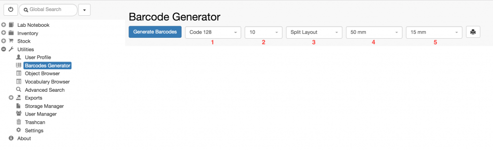
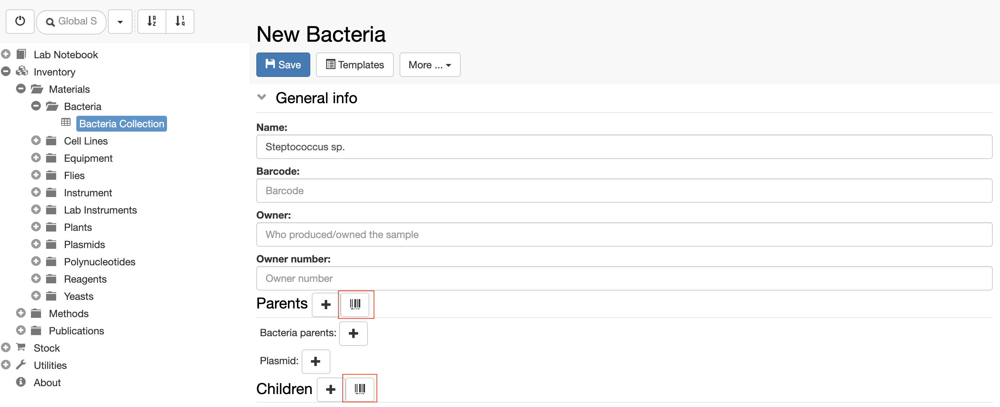
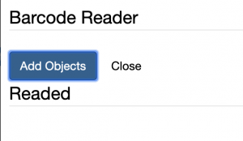

## Requirements 

**Scanner**: Any scanner that is detected as a keyboard can be used (for example, it automatically types the scanned barcodes on a word application)

**Printer**: Any printer with a driver that supports printing to PDF and PNG files can be used.

## Generate barcodes

The barcode functionality must be enabled in openBIS by a group admin ([Enable Barcodes](https://openbis.ch/index.php/docs/admin-documentation/enable-barcodes/)[)](https://openbis.ch/index.php/docs/admin-documentation/enable-barcodes/).

To generate new barcodes, go to the **Barcodes Generator** in the main menu under **Utilities**.

Users can select:

1. The type of barcode to generate:
    1. _Code 128_
    2. _QR Code_
    3. _Micro QR code_
2. The number of barcodes to generate
3. The layout:
    1. _Split_: one barcode per page
    2. _Continuous_: several barcodes in one page
4. The width of the barcode
5. The length of the barcode

After selecting the desired parameters, click the **Generate Barcodes** button.

## Using barcodes

When samples are registered, users can scan and assign barcodes to them:

1. Go to the **Parents** section in the sample form
2. Click on the **barcode icon**
3. Scan the barcode of the sample
4. Click **Add Objects**

It is possible to use either openBIS-generated barcodes, or existing barcodes (on purchased products, for example).
