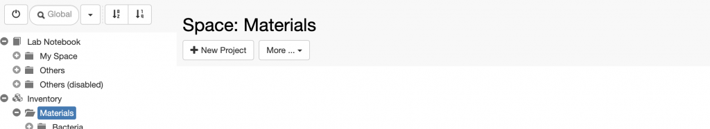
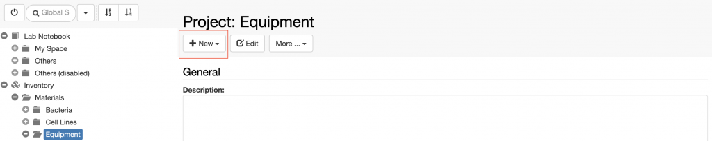

_Collections_ are folders used to organise _Objects_ in the **Materials** Inventory. Such _Objects_ can be samples, materials, equipment, patients, etc.

_Collections_ need to be organised in two folders.

For example, if we want to create a collection of lab instruments, we need to adopt the following steps:

1. Create an Object type called Instrument. This can only be done by an _Instance admin_, from the admin interface, as explained here: [New Entity Type Registration](https://openbis.ch/index.php/docs/admin-documentation-openbis-19-06-4/new-entity-type-registration/)
2. Create a first folder called Equipment
3. Create a second folder called Lab instruments

To create the first folder:

> 1. Click on the **Materials** folder
> 2. Click the **\+ New Project** button in the form.
>     
>     
>     
> 3. Provide a description of the collection, if wanted. This is not mandatory.
> 4. Enter the **Code**. This will be the name of the folder. Codes only take alphanumeric characters and no spaces. (e.g. Equipment).

To register the second folder, inside the first:

> 1. Click on the first folder, in this case **Equipment**.
> 2. Click the **\+ New** button in the main form.
>     
>     
> 3. Replace the automatically generated **Code** with something pertinent to the collection (e.g LAB\_INSTRUMENTS)
> 4. Fill in the **Name** field (e.g. Lab instruments). By default, the main menu shows the name. If the name is not provided, the code is shown.
> 5. Select the **Default Object type** from the list of available types. This is the Object for which the Collection is used. In this case, **Instrument**.
