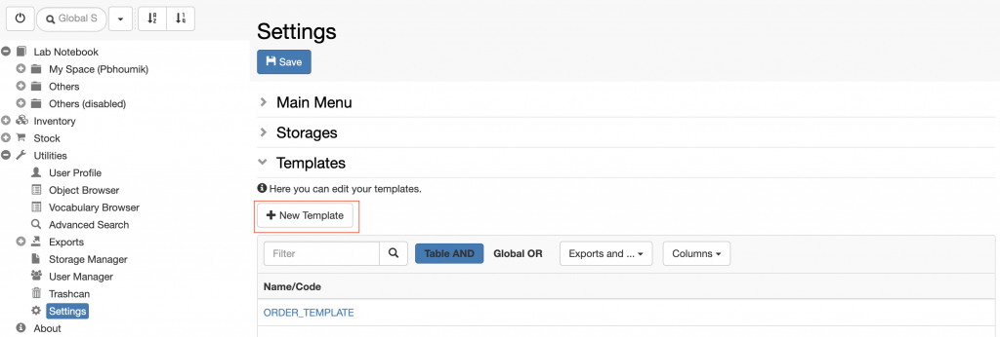
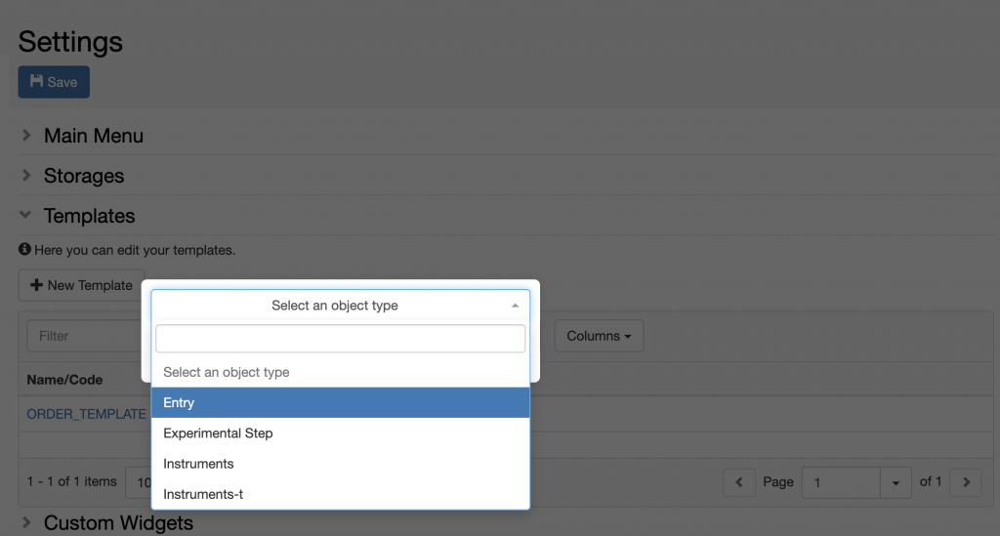
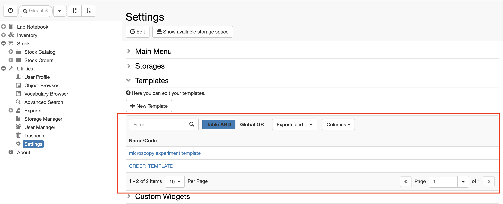

  
It is possible to create templates for _Objects_. Templates are useful when one has to register repetitive _Experimental steps_ or _protocols_ where some fields should always be pre-defined.

For each _Object_ type several templates can be created. This can be done by the lab manager, who has admin rights for editing the **Settings**.

  
Procedure:  
  

1. Go to the **Settings**, under **Utilities**
2. Scroll down to the **Templates** section
3. From the **New Template** tab select **Select an object type.**

1. Select the _Object Type_ for which you want to create a template.
2. Fill in the fields as desired.
3. **Save.**

  
Your templates will show in the table in the Templates section, as seen below

See [Register Experimental Steps](https://openbis.ch/index.php/docs/user-documentation-openbis-19-06-4/lab-notebook/register-experimental-steps/) for more info on how to use templates.
