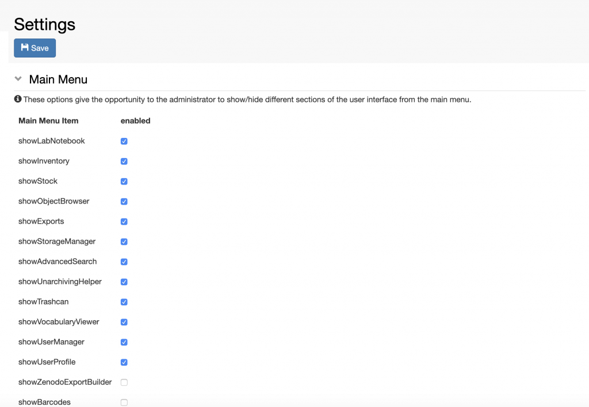

  
The main menu can be customised from the **Settings**, under **Utilities**, to hide sections that are not needed by the lab.

1. Go to **Settings**
2. Click **Edit**
3. Go to the **Main Menu** section
4. Disable the parts of the menu which are not needed
5. **Save**

