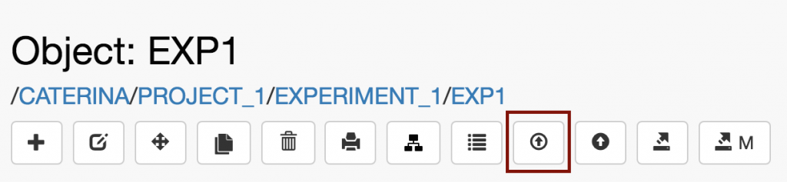
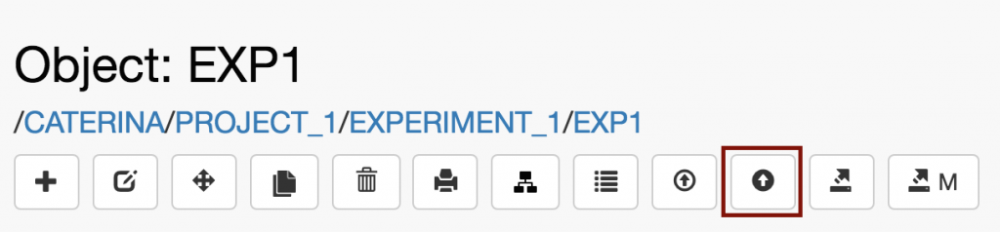

  
Data can be uploaded to _Datasets_ in openBIS _Experiments_ and _Objects_ (e.g., _Experimental Steps_). openBIS is agnostic of file formats and types.

First the _Experiment/Object_ must be registered in the database, and then _Datasets_ can be added to it. Data can be uploaded in 3 ways, as explained below.  
  

## **Upload without metadata**

  
Files or zip files can be dropped on the right hand-side of an _Experiment/Objec_t form

1. Choose the **Dataset type** from the drop-down menu. Please note that in the life science version, fasta files are automatically recognised as Datasets of type _SEQ\_FILES_.
2. Drag and drop one or multiple files in the **Files Uploader area**. Alternatively, browse for files by clicking _Select files to upload._
3. Select **Auto upload on drop** to start the upload immediately after dropping the file. This setting is stored in memory.
4. If **Auto upload on drop** is not selected, click **Create**.
5. Please note that folders cannot be uploaded via the web-browser. Only zip files can be uploaded.

##   
**Upload with metadata**  

1. Click the **Upload Dataset** button in the toolbar of Object form.
2. Fill in the relevant fields in the form. It is advisable to always enter a **Name**, because this is shown in the menu. If the name is not provided, the dataset code is shown.
3. When uploading a zip file, users have the option to **uncompress** before import.

  
**Note for MacOS users:** the default MacOS archiver generates hidden folders that become visible in openBIS upon unarchive. To avoid this there are two options:

1. Zip using  the following command on the command-line: _zip -r  folder-name.zip folder-name  -x “\*.DS\_Store”_
2. Use an external archiver (e.g. Stuffit Deluxe).

##   
**Upload via dropbox**

  
Web upload is only suitable for files of limited size (few GB). To upload larger data, openBIS uses dropbox scripts that run in the background (see [Dropboxes](https://wiki-bsse.ethz.ch/display/openBISDoc/Dropboxes)). A default dropbox script is provided with the openBIS ELN-LIMS plugin, and the dropbox folder needs to be configured by a _system admin_. If this is configured, users need to put their data in a main folder inside the dropbox folder. The main folder with the data to upload can contain several sub-folders. The main folder needs to be named according to a specified convention and the **Helper tool for dataset upload using the eln-lims dropbox** (shown below) can be used to generate the correct name.

