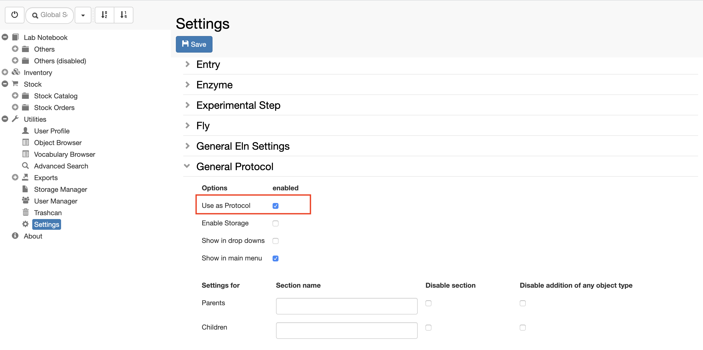

  
When a new _Object type_ for a protocol is registered by an _Instance admin_ in the admin interface, it is advisable to set the _Object type_ to **Protocol** in the **Settings**, under **Utilities**.

  
For this, follow the steps below:  
  

1. Go to **Settings**
2. Click **Edit**
3. Scroll to the last section of the **Settings**: **Object Type definitions Extension**
4. Open the _Object type_ corresponding to your protocol, e.g. **General Protocol**
5. Select **Use as Protocol**
6. **Save**

  
This is done to be able to use protocols from the inventory as templates when writing _Experimental steps_. This allows to create a local copy of a protocol from the inventory in an _Experiment_ in a user's folder.
