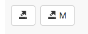
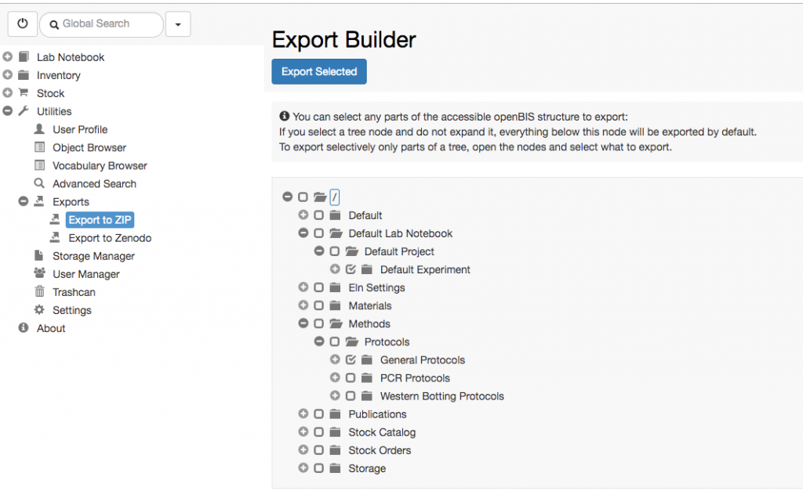

  
All levels of the _Lab Notebook_ and _Inventory_ can be exported, using the 2 export icons in the _Space, Project, Experiment, Object_ and _Dataset_ forms toolbar. The first icon is used to export metadata + data, the second icon allows to export only metadata.

In this way, users can export their complete lab notebook with all data contained in it. Everything is exported to a zip file, which maintains the same structure used in openBIS. Each folder contains several file formats (_.txt, .html, .json, .docx_) with the metadata of the corresponding _Project, Experiment, Object or Dataset_.

  
A link to download the zip file is sent via email to the user. Email notification needs to be configured by a _system admin_ during or after installation (see [openBIS Data Store Server](https://wiki-bsse.ethz.ch/display/openBISDoc1906/Installation+and+Administrators+Guide+of+the+openBIS+Data+Store+Server))

##   
Export Builder

  
It is also possible to export the content of the ELN-LIMS using the **Exports** **to ZIP** under **Exports** in the **Utilities** main menu.  Here users can select items from different _Spaces_ and export them.

