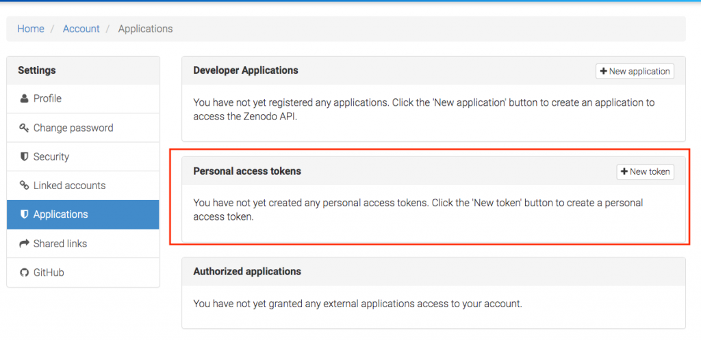
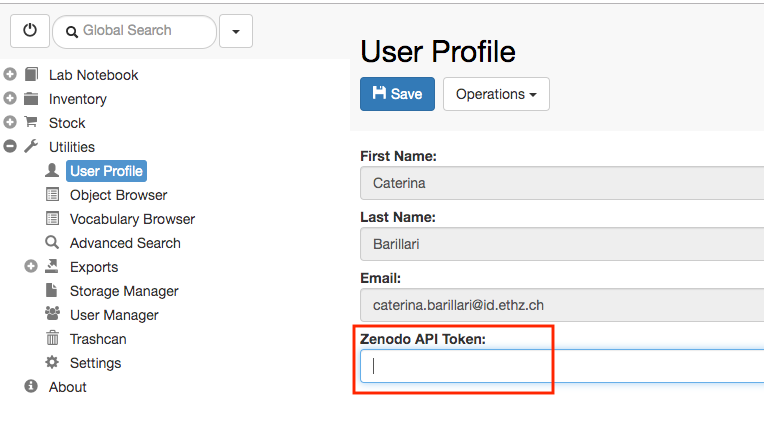
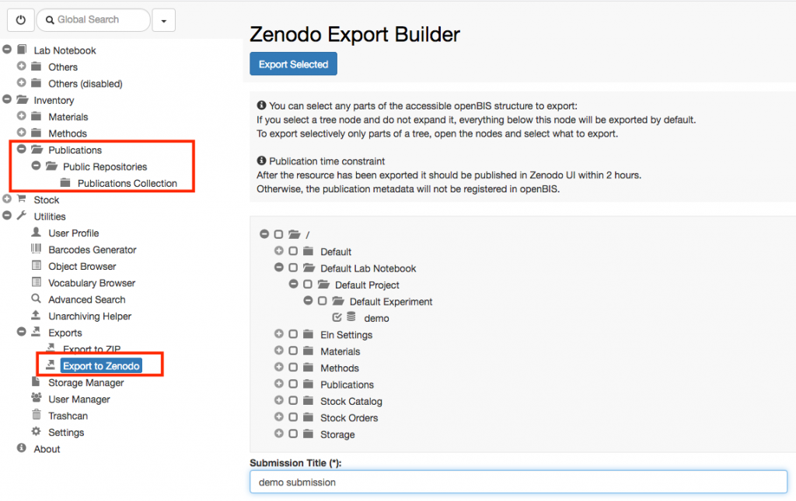

  
Currently openBIS offers an integration with the **Zenodo** data repository ([https://zenodo.org/).](https://zenodo.org/)

  
This enables data direct data transfer from openBIS to Zenodo. This feature needs to be enabled by a lab manager, who has admin rights for the **Settings:** [Enable Transfer to Data Repositories](https://openbis.ch/index.php/docs/admin-documentation/enable-transfer-to-data-repositories/)

##   
Create Zenodo Personal Access Token

  
In order to be able to export data to Zenodo, you need a valid Zenodo account. You also need to create a **personal access token.** This can be done from the **Applications** under **Settings** in Zenodo, as shown below:

## Save Zenodo Personal Access Token in openBIS

  
After creating the personal access token in Zenodo, this needs to be stored in openBIS, with the following procedure:

1. Go to **User Profile** under **Utilities** in the main menu
2. Enable editing
3. Add the personal access token from Zenodo
4. **Save**

## Export data to Zenodo

  
To export data to Zenodo:

1. Go to **Exports** -> **Export to Zenodo** under **Utilities** in the main menu
2. Select the data you want to export from the menu
3. enter a **Submission** **Title**
4. Click **Export Selected** on top of the export form
5. You are now redirected to Zenodo, where you should fill in additional metadata information.

After submission to Zenodo, an _Object_ with the information of the submission is created in openBIS and stored in the **Publications Collection**, in the **Inventory**.
