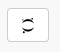
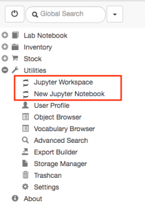
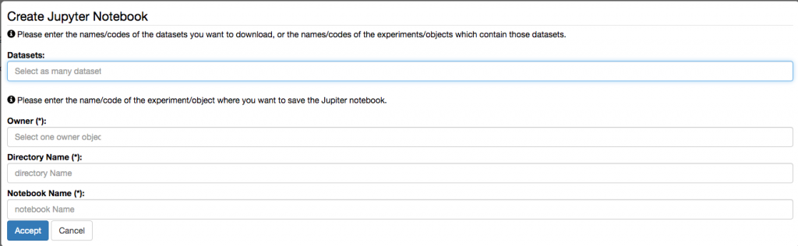
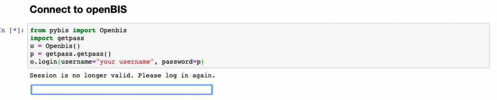
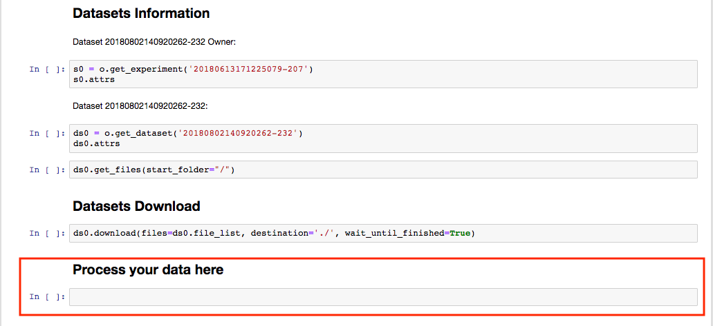

  
Jupyter notebooks are web applications that combine text, code and output ([https://jupyter.org/](https://jupyter.org/)). Jupyter supports over 40 programming languages.

Jupyter notebooks can be used to analyze data stored in openBIS.  
  

It is possible to connect to a JupyterHub server and launch Jupyter notebooks directly from the openBIS interface. This feature is not available by default, but needs to be enabled and configured by a _system admin_. JupyterHub docker containers are available from our download page: [openBIS download](https://wiki-bsse.ethz.ch/display/bis/openBIS+Download+Page).

The kernels supported by the JupyterHub server for openBIS are: _Bash_, _Octave_, _Python_ _2_, _Python 3_, _R_, _SoS_. 

Further documentation can be found here: [JupyterHub for openBIS](https://wiki-bsse.ethz.ch/display/openBISDoc1906/JupyterHub+for+openBIS)  
  

Jupyter notebooks can be opened at every level of the openBIS hierarchy (Space, Project, Experiment/Collection, Object, Dataset) by clicking the Jupyter icon:

It is also possible to launch a Jupyter notebook from the main menu, under Utilities, or open a workspace on the JupyterHub server.

To create a notebook, it is necessary to enter:  
  

1. The dataset(s) needed for the analysis
2. The owner of the Jupyter notebook. Jupyter notebooks are saved back to openBIS as datasets, and these belong either to an Experiment/Collection or to an Object. The owner is the Experiment/Collection or Object where the notebook should be stored.
3. The directory name. This is the name of the folder that will be created on the JupyterHub server.
4. Notebook name. This is the name of the Jupyter notebook

##   
Overview of Jupyter notebook opened from openBIS.

  
The Jupyter notebook opened from the openBIS interface contains some pre-filled cells. All cells need to be run. The information of two cells should be modified: Name of the dataset where the notebook will be stored and Notes (in red below).

If you get this message "_Session is no longer valid. Please login again_" replace the code in the cell after _Connect to openBIS_ with the following:

When you run the cell, you will be prompted to enter your password. 

Your script should be written in the section named _Process your data here_, that contains one empty cell (see below). You can, of course, add additional cells.

After the analysis is done, the notebook can be saved back to openBIS, by running the last few cells which contain the information about where the notebook will be stored (as shown below).

A JupyterLab openBIS extension is also available: [JupyterLab openBIS extension](https://www.npmjs.com/package/jupyterlab-openbis)

This enables connectivity between JupyterLab and openBIS.
