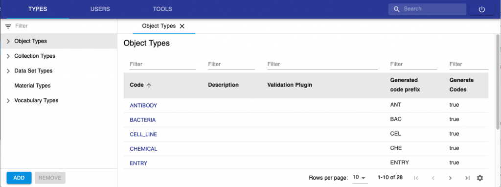
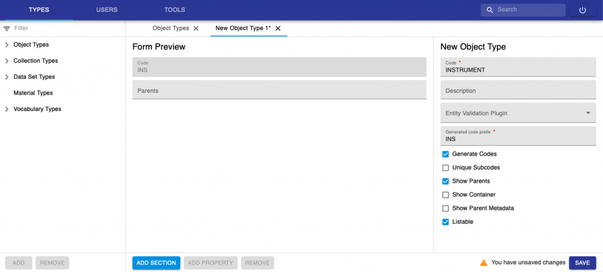
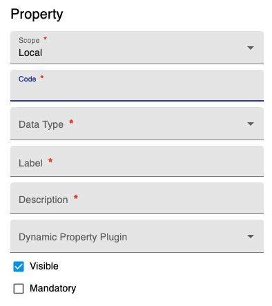
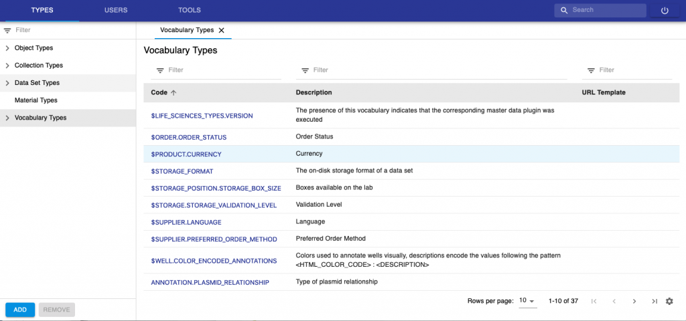
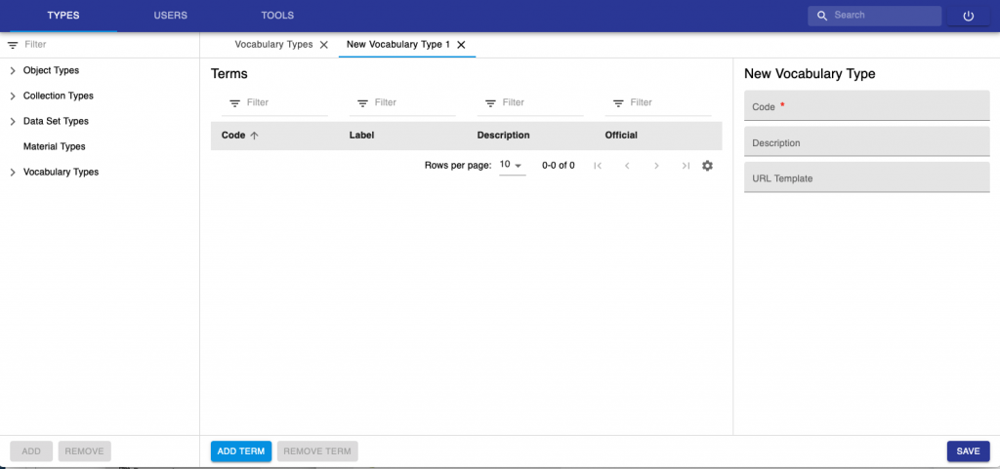
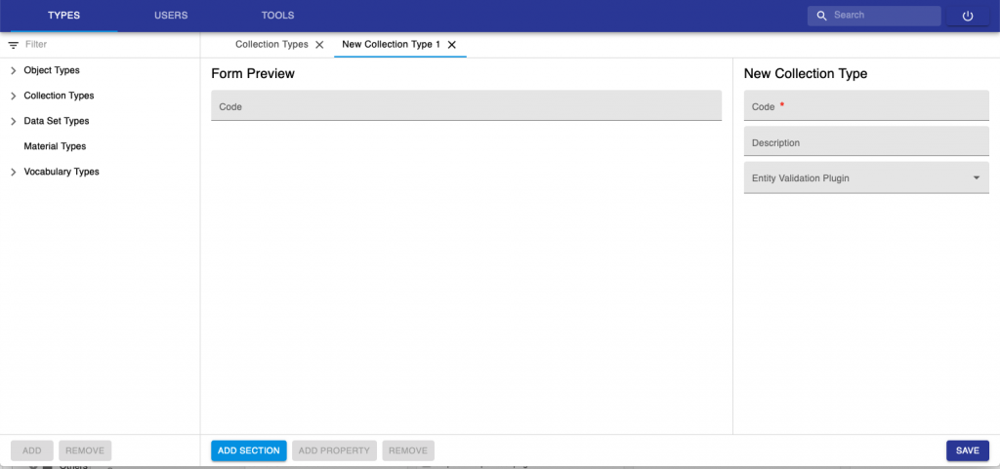
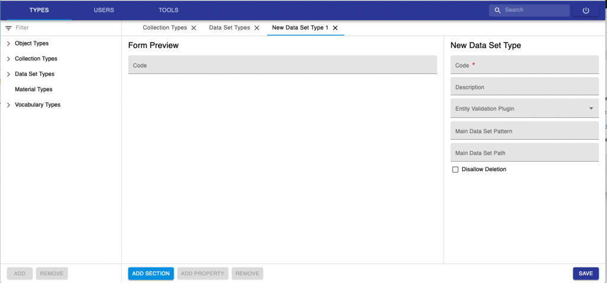

  
Entity types, i.e. _Experiment/Collection_, _Object_ and _Dataset_ types can be created by someone with _Instance admin_ role in the **new Admin openBIS UI**.

  
The new Admin openBIS UI can be accessed via a URL of this type: **https://openbis-xxx/openbis/webapp/openbis-ng-ui/**

  
where openbis-xxx is the name of the server specified in the openBIS configuration file, during the installation by a system admin.

## Register a new Object Type

1. Select **Types -> Object Types** from the menu.
2. Click **Add** at the bottom of the page.

3\. Enter a **_Code_**. E.g. **INSTRUMENT**. This is the name of the Object to create and is unique. Please note that Codes should be in capital letters, and they can only contain A-Z, a-z, 0-9 and \_, -, .

4\. Provide a description (not mandatory).

5\. Entity validation plugin is used when we want to have validation on some data entries. This is done via a custom script (see [Entity Validation Scripts](https://unlimited.ethz.ch/display/openBISDoc2010/Entity+validation+scripts))

6\. Enter the **Generated Code Prefix**. As a convention, we recommended to use the first 3 letters of the _Object_ _type_ code (e.g. **INS**, in this case). This field is used by openBIS to automatically generate Object codes: the codes will be for example INS1, INS2, INS3, etc.

7\. Leave all selectable options as provided by default.

8\. Click **Add Section** at the bottom of the page. Sections are ways of grouping together similar properties. Examples of sections used in the ELN are _General info_, _Storage info_, _Experimental Details_, etc.

9\. Add properties inside the Section, by clicking the **Add Property** button at the bottom of the page. To remove a property, use the **Remove** button at the bottom of the page.

9\. Click **Save** at the bottom of the page.

Please note that new Objects do not automatically appear in ELN drop downs, but they have to be manually enabled, as described here: [Enable Objects in dropdowns](https://openbis.ch/index.php/docs/admin-documentation-openbis-19-06-4/new-entity-type-registration/enable-objects-in-dropdowns/) 

## Registration of Properties

When registering new properties, the fields below need to be filled in.

1. **Scope**. Can be **Local** or **Global**. Local is for properties specific to a given Object type (or Collection or Dataset). Global is to be used for generic properties that can be reused across types. For example "Name", "Description" can be Global Properties. When selecting Global property, a list of available properties is presented. It is possible to choose from already existing properties or create a new global property. Global properties starting with the "$" symbol are internal properties that cannot be deleted nor modified via the user interface. 
2. **Code.** Unique identifier of the property. Codes can only contain A-Z, a-z, 0-9 and \_, -, .
3. **Data Type.** See below for data types definitions.
4. **Label.** This is the property/column header that the user can see in the ELN.
5. **Description**: Defined by admin. In most cases, label and description can stay the same.
6. **Dynamic Property Plugin**: Script for calculated properties. See [Dynamic properties](https://unlimited.ethz.ch/display/openBISDoc2010/Dynamic+Properties)
7. **Visible**: Visible in Edit mode.
8. **Mandatory**: Field can be set as mandatory.

### Property Data Types

1. **BOOLEAN**: yes or no
2. **CONTROLLEDVOCABULARY**: list of predefined values
3. **DATE**. Date field
4. **HYPERLINK**: URL
5. **INTEGER**: integer number
6. **MATERIAL**. Not used in ELN. It will be dismissed.
7. **MULTILINE\_VARCHAR**: long text. It is possible to enable a Rich Text Editor for this type of property. This is described here: [Enable Rich Text Editor or Spreadsheet Widgets](https://openbis.ch/index.php/docs/admin-documentation-openbis-19-06-4/new-entity-type-registration/enable-rich-text-editor-or-spreadsheet-widgets/)
8. **REAL**: decimal number
9. **OBJECT**. 1-1 connection to a specific object type.
10. **TIMESTAMP**: date with timestamp
11. **VARCHAR**: one-line text
12. **XML**: to be used by _Managed Properties_ (see [openBIS Managed Properties](https://unlimited.ethz.ch/display/openBISDoc2010/Managed+Properties)[)](https://wiki-bsse.ethz.ch/display/openBISDoc1906/Managed+Properties) and for _Spreadsheet component_s, as described here:[Enable Rich Text Editor or Spreadsheet Widgets](https://openbis.ch/index.php/docs/admin-documentation-openbis-19-06-4/new-entity-type-registration/enable-rich-text-editor-or-spreadsheet-widgets/)

#### Controlled Vocabularies

Controlled vocabularies are pre-defined lists of values for a given field.

Existing Vocabularies can be visualised from the Types -> Vocabularies Tab. Vocabularies staring with the "**$**" symbol are internal: they cannot be deleted and their terms cannot be deleted. However, it is possible to add new terms to these vocabularies and these can also be deleted.

New Vocabularies can be added, by clicking the **Add** button at the bottom of the page.

When registering a new vocabulary, a Code for the vocabulary needs to be entered. This corresponds to the name of the vocabulary, and it is a unique identifier. Codes can only contain A-Z, a-z, 0-9 and \_, -, .

To add terms to the list click **Add Term** at the bottom of the page. Vocabulary terms always have a code and a label: the code is unique and contain only alpha-numeric characters; labels are not necessarily unique and allow also special characters. If the label is not defined, codes are shown.

After creating the vocabulary and registering the terms, remember to **Save**. 

## Register a new Experiment/Collection type

The registration of a new **Collection** type is very similar to the registration of **Object** types. For Collection Types, you only need to provide a Code (which is a unique identifier), Description and add a validation plugin if you want to have metadata validation (see [Entity Validation Scripts](https://unlimited.ethz.ch/display/openBISDoc2010/Entity+validation+scripts)). 

## Register a new Dataset type

The registration of a new Dataset types is similar to the registration of object types. 

It is possible to disallow deletion for a given dataset type.

