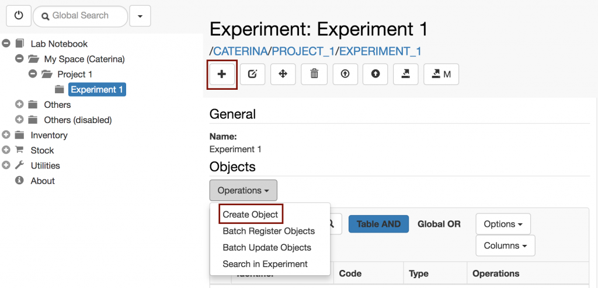
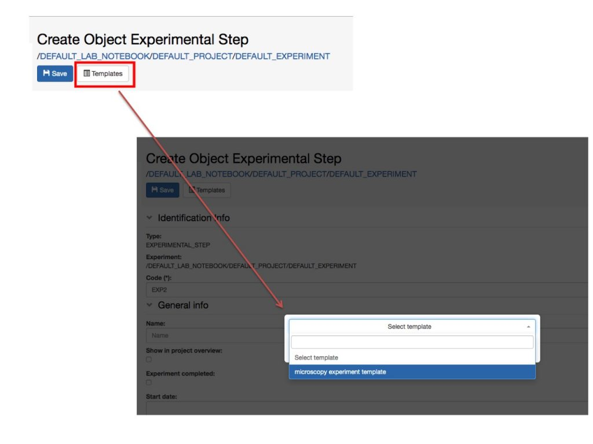
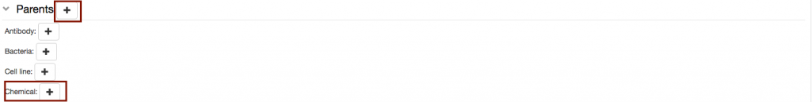
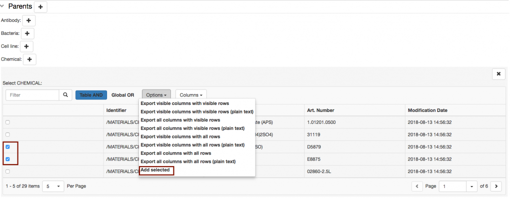
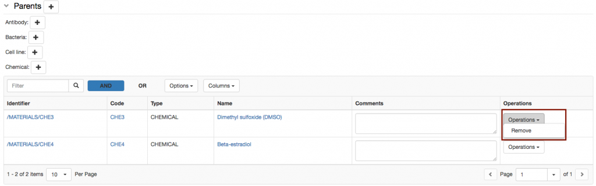
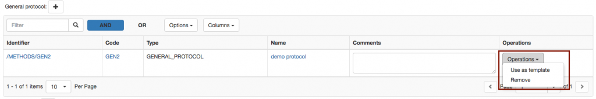
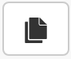
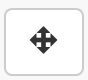

  
As mentioned above, the various steps executed when performing an Experiment in the lab can be registered in openBIS as _Objects_ of type _Experimental Step_.

  
To register a default _Experimental Step_, with pre-defined fields:  
  

1. Navigate to the relevant **Experiment** in the _Lab Notebook_ menu and click the **\+** button, as shown below.
2. Fill in the relevant information on the form or select an available template from the list.
3. When filling in the form, it is advisable to leave the auto-generated code unchanged and to provide a **Name**. The Name is shown by default in the main menu. If a name is not provided, the code is shown.
4. If **Show in project overview** is selected, this _Experimental Step_ will be displayed on the _Project_ page.
5. Click **Save** on top of the form.

  
Alternatively, to register a custom _Experimental Step_:  
  

1. Select **Create Object** from the **Operations** drop down in the **Objects** section of the Experiment form, as shown below.
2. Select the desired **Object type**.
3. Fill in the form as mentioned above.
4. Click **Save** on top of the form.

## Using Templates

  
Templates need to be defined by the lab manager in the Settings. If templates have been created for a given _Experimental Step_, you can choose form the list of available templates by clicking the **Template** button on the _Object_ form, as shown below.

##   
**Connections to Inventory or other Experimental Steps**

  
In the default _Experimental Step_, there is a **Parents** section where it is possible to specify links to _materials_ and _methods_ from the Inventory or to any other _Object_, e.g. another _Experimental Step_.  
  

**Parents** are all samples/materials used in an _Experimental Step_ and also standard protocols from the inventory followed in the _Experimental Step_. It is also possible to set one _Experimental Step_ as parent of a second _Experimental Step,_ to keep the connection between the two.

  
The name of this section is customisable by the lab admin: [Customise Parents and Children Sections in Object Forms](https://openbis.ch/index.php/docs/admin-documentation/customise-object-forms/)  
  

The default _Experimental Step_ in openBIS ELN-LIMS for life sciences has some predefined parents in the form. These defaults can also be modified by the lab admin: [Customise Parents and Children Sections in Object Forms](https://openbis.ch/index.php/docs/admin-documentation/customise-object-forms/)  
  

In the generic openBIS ELN-LIMS, the **Parents** section should be fully customised by the lab admin.  
  

### To add a parent (or connection):  
  

1. The **+** button next to the **Parents** section allows to choose among the list of all available _Object_ types.
2. The **\+** button next to each pre-defined _Object_ type allows to add parents of that type only.

3\. To add a single parent, click on an _Object_ row in the table.

4\. To add multiple parents:

- Select the desired _Objects_ from the table.
- Choose **Add selected** from the **Options** dropdown menu in the table, as shown below.

### To remove a parent (or connection):

  
To remove a parent, choose **Remove** from the **Operations** drop down in the parent table, as shown below.  
  

##   
**Children**

  
Children of _Experimental Steps_ are usually derivative _Experimental Steps,_ or _samples._ As for the **Parents** section, this section can also be customised by a lab admin in the Settings.

To add a child:

1. Click on the + button next to the **Children** section.
2. Select the relevant **Object** type from the list of available types.
3. Proceed as explained above for adding parents.

####   
_**Children Generator**_

The **Children Generator** creates a matrix of all the parents entered in the _Experimental Step_, as shown below. Combinations of parents needed to generate children can then be selected by the user. The _Object_ type to assign to the children and the number of replicas need to be specified. The children will then be automatically generated by openBIS upon registration of the _Experimental Step_.

##   
Adding Protocols to an Experimental Step

  
When adding protocols to an Experimental steps, two options are available:

1. Link to a **Protocol** stored in the Inventory. This can be used if the protocol was followed exactly in all steps as described.
2. Create a **local copy of the Protocol** from the Inventory in the current Experiment. This should be done if some steps of the main protocol was modified. These modifications can be edited in the local copy of the protocol, while the template is left untouched.

  
To create a local copy of a template protocol stored in the Inventory:

1. Select a protocol as parent.
2. From the **Operations** dropdown in the parents table select **Use as template**
3. Provide the **Object code** for the new protocol.
4. A copy of the protocol is created under the current Experiment, where the user can modify it. This copy has the original protocol set as parent, so that connection between the two is clear.

##   
**Comments Log**

  
Several comments can be added by different users who have write-access to a given user Space:

1. Click the + button in the **Comments Log**_._
2. Enter the **comment**.
3. Click **Save**_._
4. The user who added the comment and the time when the comment was entered are shown on the form.

##   
Copy an Experimental Step

To copy an _Experimental Step_, select the **copy** button (shown above) in the _Experimental Step_ form toolbar.

When an _Experimental Step_ is copied, the user has the option to **link parents, copy children** and **copy the comments log.**

##   
Move an Experimental Step

To move an _Experimental Step_ to a different _Experiment_, select the **move** button (shown above) in the _Experimental Step_ form toolbar.
