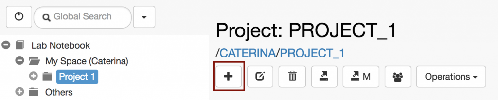
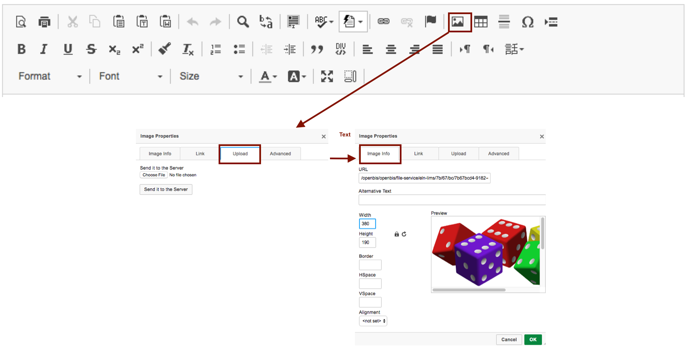

  
Inside one _Project_, a user can register several _Experiments_, which can in turn be divided into single _Experimental Steps:_

1. Navigate to the relevant _Project_ in the **Lab Notebook** menu
2. Fill in the relevant fields in the form.
3. Select **Show in project overview** if the _Experiment_ is important and should be shown in the _Project_ form.
4. Click **Save** on top of the form.

##   
Embed images in text fields

  
It is possible to embed images in rich text editor fields, in the following way:  
  

1. Click on the **image** icon highlighted in red in the image below.
2. In the pop-up window, go to the **Upload tab**_._
3. Browse for your image and click on **Send to Server**.
4. To adjust the image size, go to the **Image Info** tab.
5. Click **OK** at the bottom of the widget.

