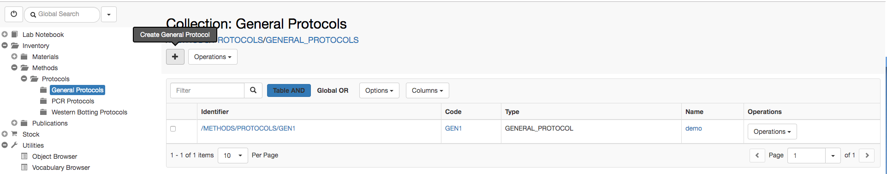
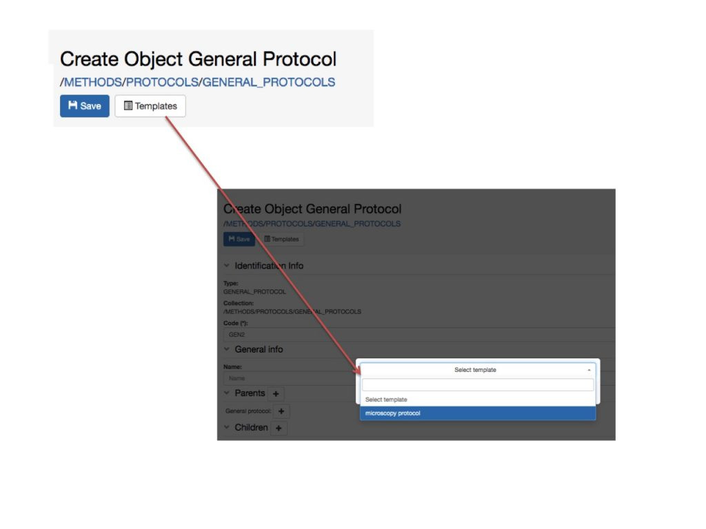

  
Protocols are standard procedures used in the lab. If such procedures are in place, they should be organised in folders in the **Methods** Inventory which, by default, is accessible by all lab members.

To register a new protocol in a predefined folder Collection, follow these steps:

1. Go to the relevant _Collection_ in the **Methods** folder.
2. Click the **\+** button in the main page
3. Fill in the relevant fields in the form or choose from available templates.
4. **Save**

## Using Templates

  
Templates need to be defined by the lab manager in the Settings. If templates have been created for a given _Protocol type_, you can choose form the list of available templates by clicking the **Template** button on the _Object_ form, as shown below.

## Links to samples, materials, other protocols

When writing a protocol, it is possible to create links to samples, materials or other protocols stored in the Inventory.

This is done in the **Parents** section. Everything that is used in the protocol can be added as **Parent** of the protocol itself.
