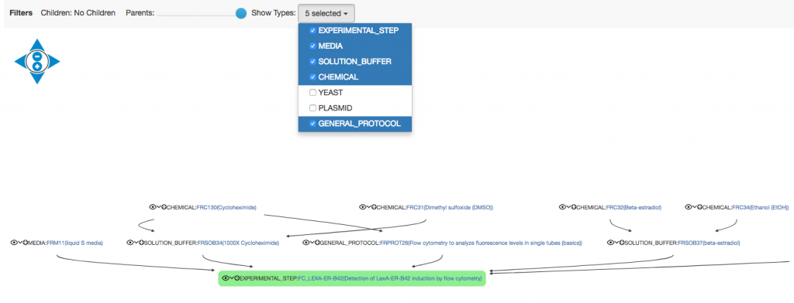

  
Parent-child relationships between _Objects_ can be visualised as trees or tables in the ELN.

To see the genealogical tree, select the **tree** icon  from the _Object_ toolbar:

Large trees can be pruned, by selecting how many levels of parents and/or children and which types to show.

To view the genealogy of an _Object_ in a tabular format, select the **table**  icon  from the _Object_ toolbar:

