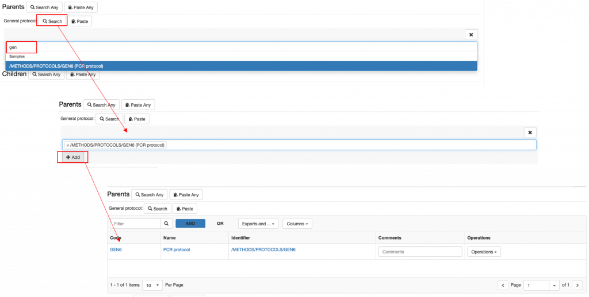
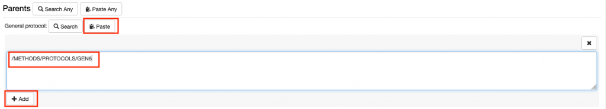
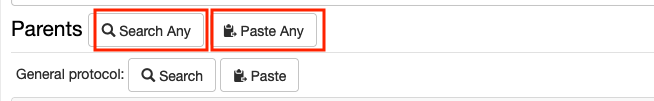
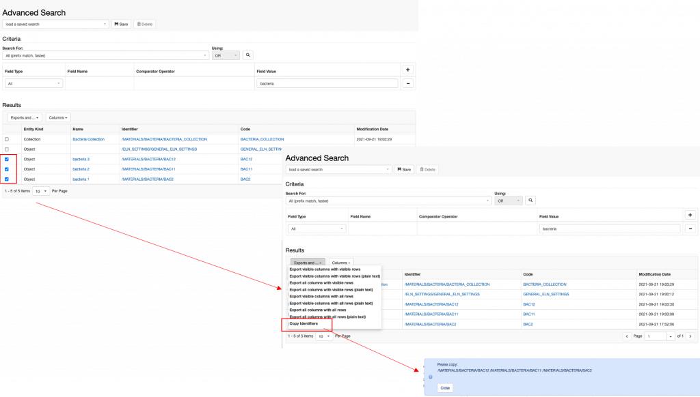
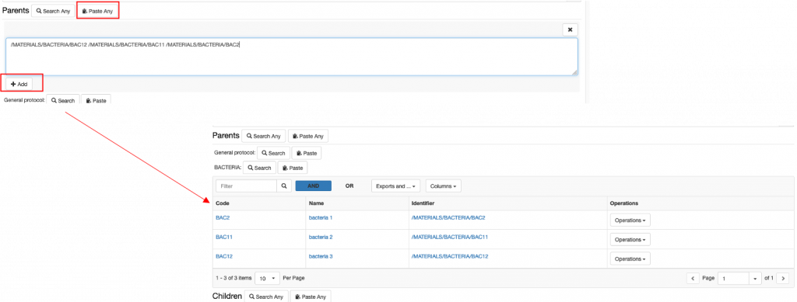
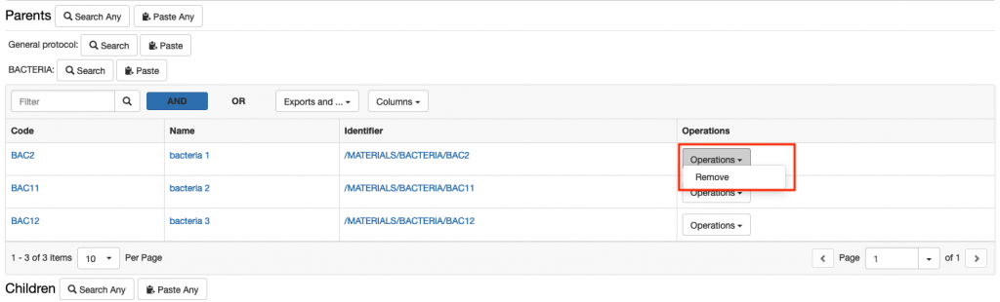
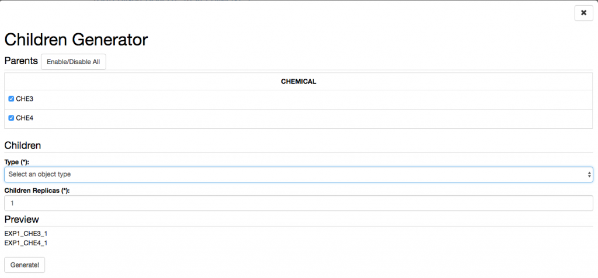
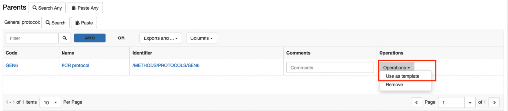

In the default _Experimental Step_ and in the _Entry_, there is a **Parents** section where it is possible to specify links to _materials_ and _methods_ from the Inventory or to any other _Object_, e.g. another _Experimental Step_ or _Entry_.

**Parents** are all samples/materials used in an experimental procedure and also standard protocols from the inventory followed in the experimental procedure. It is also possible to set one _Experimental Step/Entry_ as parent of a second _Experimental Step/Entry,_ to keep the connection between the two.

The name of this section and which parents should be shown in the form, is customisable by the lab admin as described in [Customise Parents and Children Sections in Object Forms](https://openbis.ch/index.php/docs/admin-documentation-openbis-19-06-4/customise-parents-and-children-sections-in-object-forms/)

# Adding a parent 

## Adding a parent of a predefined type in the form

In the screenshot above, General Protocol is predefined as parent type in the form. We have two options to add a parent of this predefined type:

### **1\. Search**

1. 1. Click on the Search button
    2. enter the name or code of the entry you want to add as parent
    3. select the entry you want to add from the list presented to you
    4.  click the +Add button

      

### **2\. Paste**

1. 1. paste the identifier of the object you want to add as parent. You may copy the identifier from a file, or from an advanced search or from another ELN page.
    2. click the +Add button

      

## Adding parent of any available type

If you want to add a parent that is not specified in the Experimental Step form, you can use the **Search Any** or Paste Any options next to **Parents.**

### 1\. Search Any

1. Click Search Any
2. Select the object type for which you want to add a parent
3. Search by code or name as explained above
4. Click the + Add button

### 2\. Paste Any

There are cases where you may want to add several parents of the same type or also of different types. In this case, we recommend to use the **Advanced Search** to find the entries you want to add and copy identifiers from here which you can then copy in the Paste Any field, as shown below.

# Removing a parent 

To remove a parent, choose **Remove** from the **Operations** drop down in the parent table, as shown below.

# **Adding and Removing Children**

Children of _Experimental Steps_ are usually derivative _Experimental Steps,_ or _samples._ As for the **Parents** section, this section can also be customised by a lab admin in the Settings ([Customise Parents and Children Sections in Object Forms)](https://openbis.ch/index.php/docs/admin-documentation-openbis-19-06-4/customise-parents-and-children-sections-in-object-forms/).

The procedure for adding and removing children is the same as explained for parents.

## Children Generator

The **Children Generator** creates a matrix of all the parents entered in the _Experimental Step_, as shown below. Combinations of parents needed to generate children can then be selected by the user. The _Object_ type to assign to the children and the number of replicas need to be specified. The children will then be automatically generated by openBIS upon registration of the _Experimental Step_.

# Adding Protocols as Parents to an Experimental Step

When adding protocols to an Experimental steps, two options are available:

1. Link to a **Protocol** stored in the Inventory. This can be used if the protocol was followed exactly in all steps as described.
2. Create a **local copy of the Protocol** from the Inventory in the current Experiment. This should be done if some steps of the main protocol were modified. These modifications can be edited in the local copy of the protocol, while the template is left untouched.

To create a local copy of a template protocol stored in the Inventory:

1. Select a protocol as parent.
2. From the **Operations** dropdown in the parents table select **Use as template**
3. Provide the **Object code** for the new protocol.
4. A copy of the protocol is created under the current _Experiment_, where the user can modify it. This copy has the original protocol set as parent, so that connection between the two is clear.

## 
