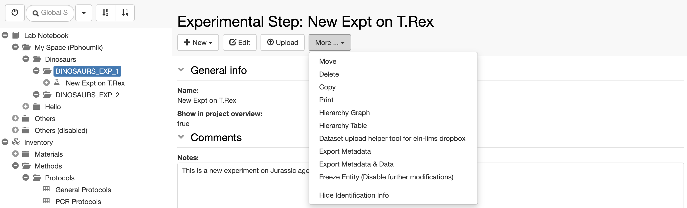

To copy an _Experimental Step_, select **Copy** from the **More...** drop down menu, as shown below.

When an _Experimental Step_ is copied, the user has the option to **link parents, copy children to the current Experiment** and **copy the comments log.** The _Experimental Step_ is copied inside the same _Experiment_.

## 
