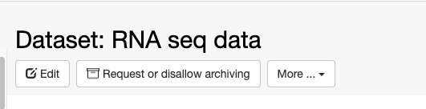
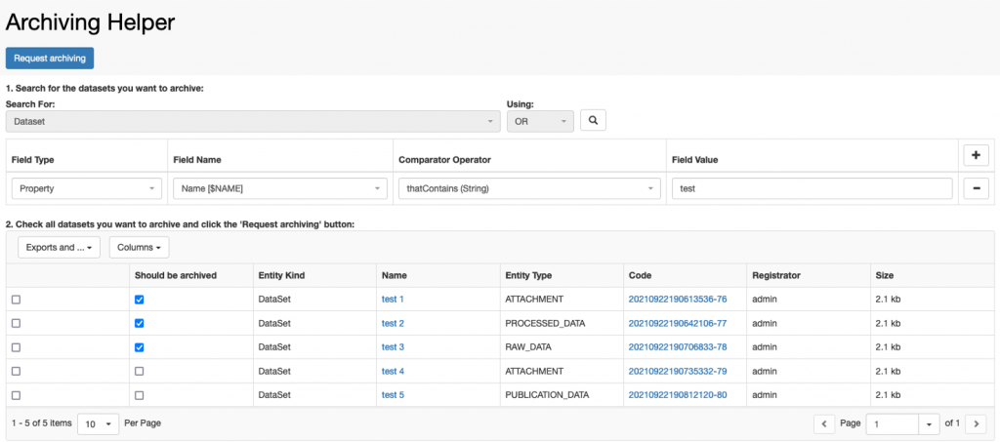
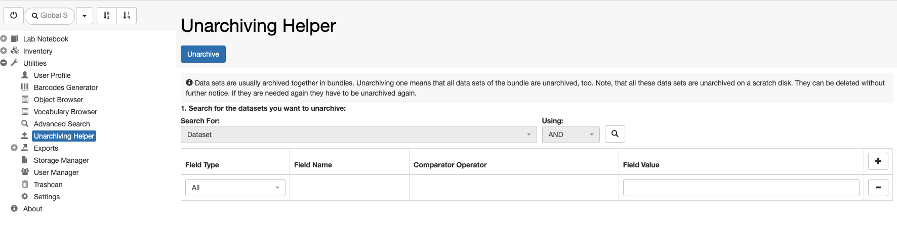

 

# Dataset archiving

 

openBIS supports archiving of datasets to Strongbox ([https://www.strongboxdata.com/](https://www.strongboxdata.com/)) as described in [Datasets Archiving](https://unlimited.ethz.ch/display/openBISDoc2010/Archiving+Datasets)

 

This needs to be set up and configured by a _system admin_.

 

To trigger archiving manually from the ELN, navigate to a dataset and use the _Request or disallow archiving_ button, as shown below.

 

 

 

 

Please note that the strongbox has a minimum size requirement of 10GB. If a single dataset is below this threshold it will be queued for archiving and it will be archived only when additional datasets in the same Space/Project/Experiment are selected for archiving and the minimum size is reached. All datasets are bundled together and archived together. This implies that if unarchiving is requested for one dataset in a bundle, all other datasets will also be unarchived.

 

## Dataset archiving helper tool

 

If you wish to archive multiple datasets, you can use the _Archiving Helper_ tool under _Utilities_ in the main menu. You can search for datasets and select multiple ones to be archived.

 

# Dataset unarchiving

 

Once the dataset is archived on tapes, the button on the dataset page changes to _Unarchive_, as shown below. Datasets can be unarchived by using this button.

 

 

 

## Dataset unarchiving helper tool

 

To unarchive several datasets it is possible to use the _Unarchiving Helper_ tool, under _Utilities_ in the main menu, as shown below. You can search for datasets and select multiple ones to be unarchived.

