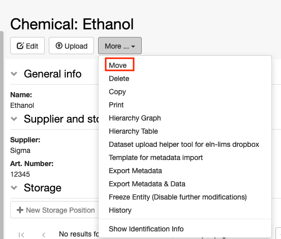
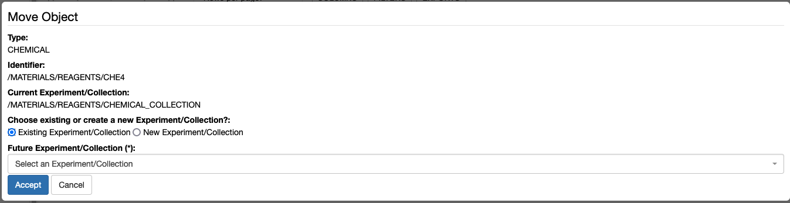

 

You can move entries to a different _Collection_ either from the e_ntry_ form or from a _Collection_ table.

 

## Move from entry form

 

To move entries to a different _Collection_, select **Move** from the **More...** drop down menu in the entry form.

 

 

You have the option to move to an existing _Collection_ or to create a new _Collection_.

 

 

## Move from Collection Table

 

It is also possible to move objects from _Collection_ tables. You can select one or multiple entries from a table and click on the **Move** button.

Also in this case you can move to an existing _Collection_ or create a new one.

 

